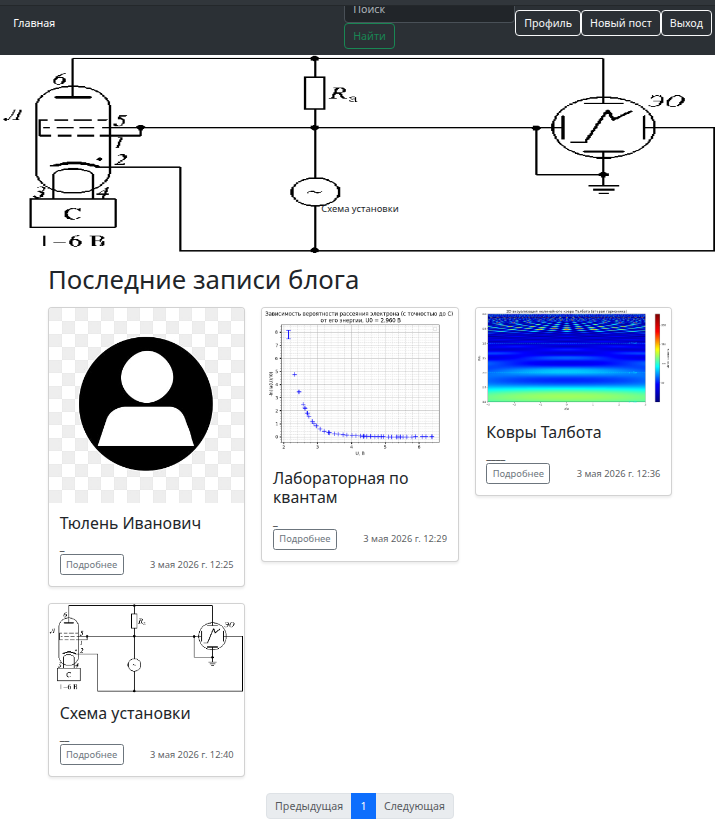
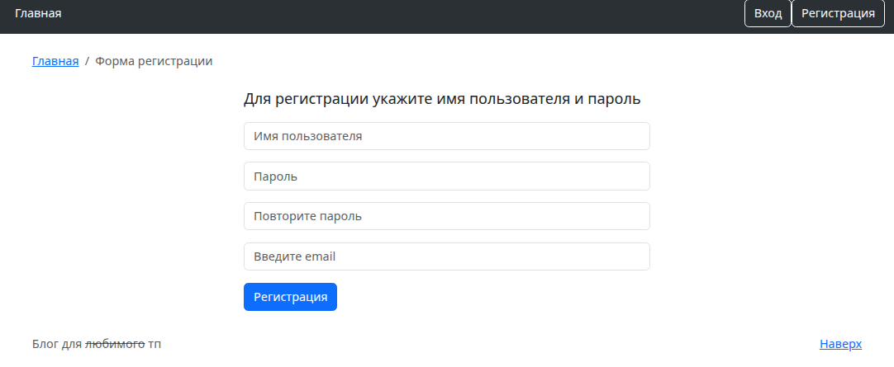
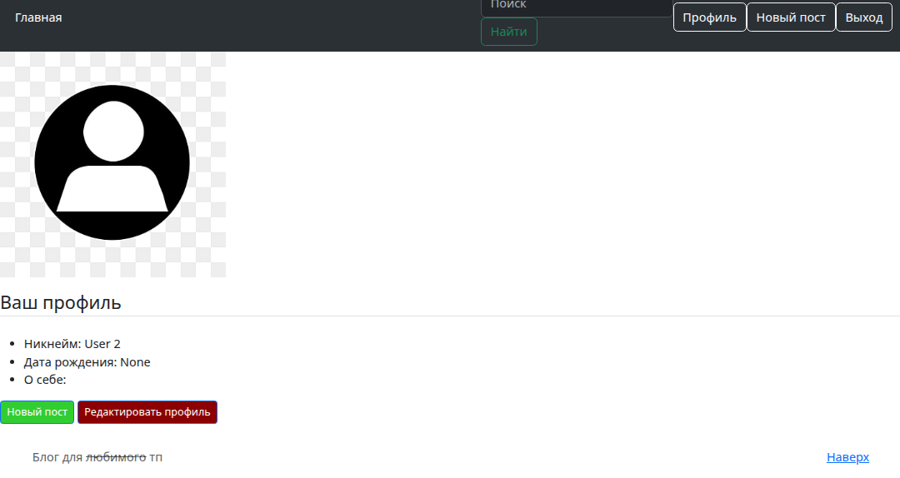
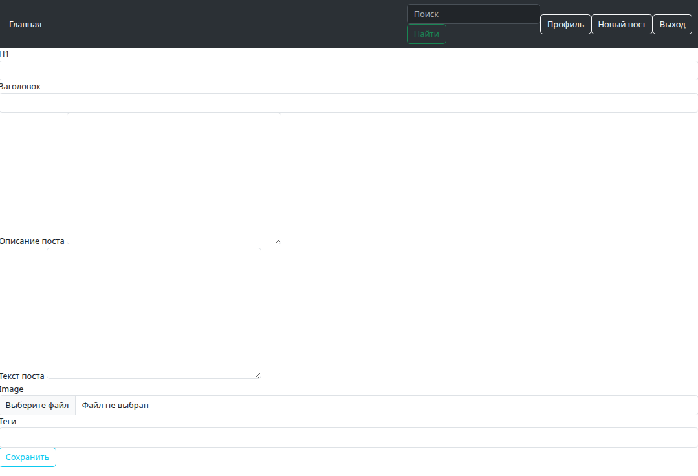
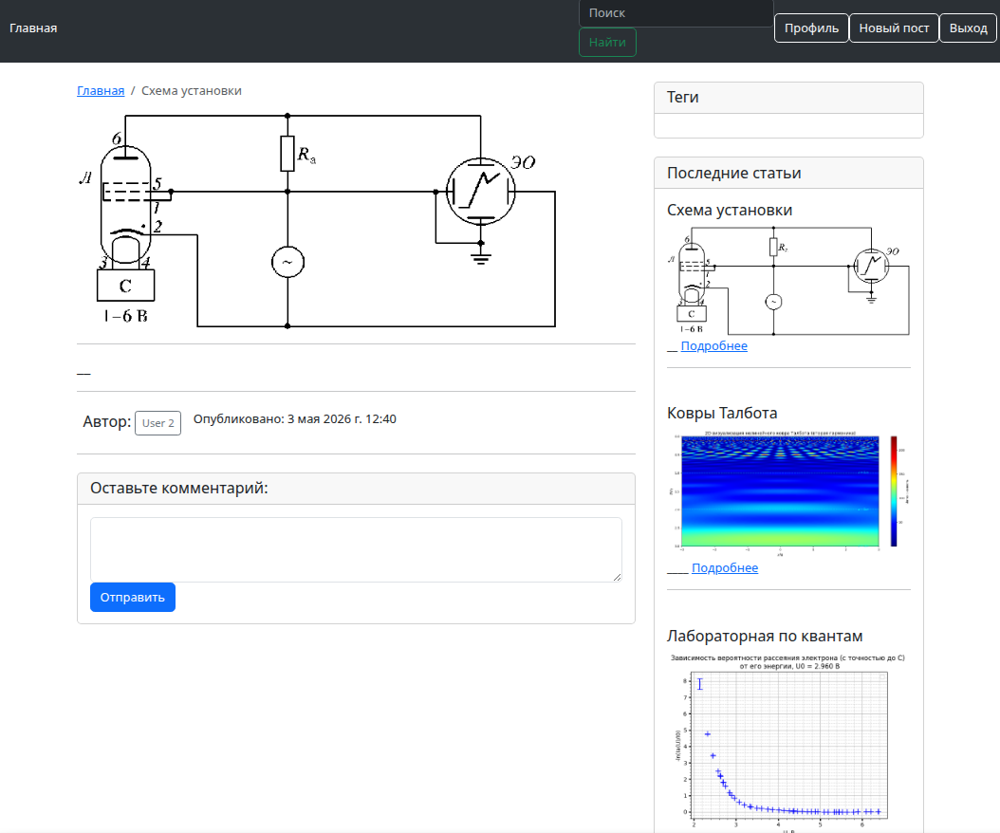
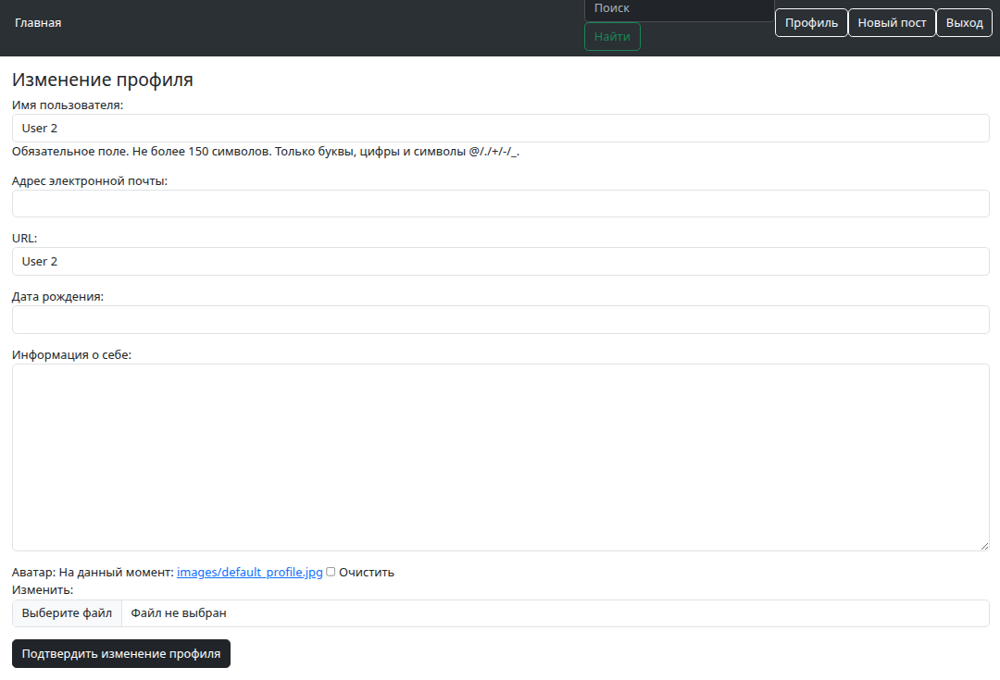

# Мини-блог


## Запуск
Проект запускается из корневой директории ```tp-2024-petrakova-anastasia-project``` с помощью файла ```run.sh```:

```./run.sh```

## Скриншоты

| Главная страница | Регистрация | Профиль пользователя |
|-----------------|-------------|----------------------|
|  |  |  |

| Новый пост | Просмотр поста | Редактирование профиля |
|------------|----------------|------------------------|
|  |  |  |

## Функциональность

- **Регистрация и авторизация** — создание аккаунта с валидацией полей
- **Профиль пользователя** — просмотр и редактирование: никнейм, email, дата рождения, информация о себе, аватар
- **Посты** — создание, просмотр, редактирование, удаление. Поддержка заголовка, описания, текста, изображения
- **Теги** — добавление тегов к постам
- **Комментарии** — возможность оставлять комментарии под постами
- **Главная страница** — лента с последними записями, пагинация

## Технологии

- Python 3.11+
- Django 4.x
- SQLite (разработка)
- PyTest (тестирование)
- HTML/CSS (Bootstrap)

